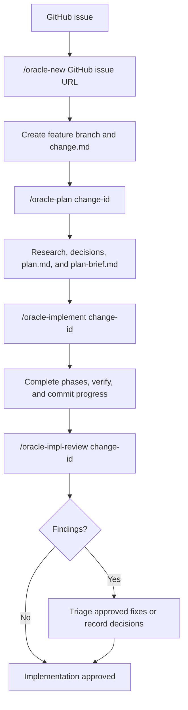
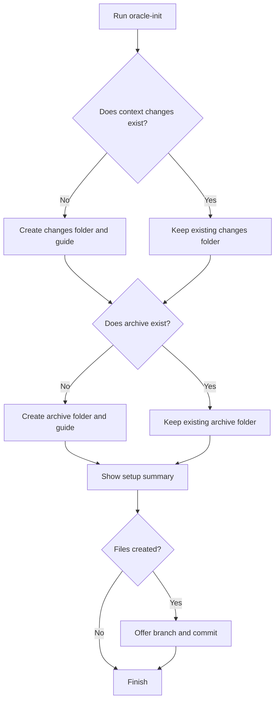
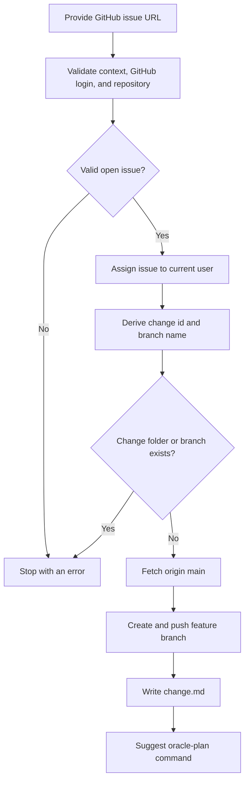
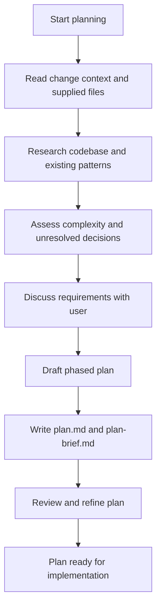
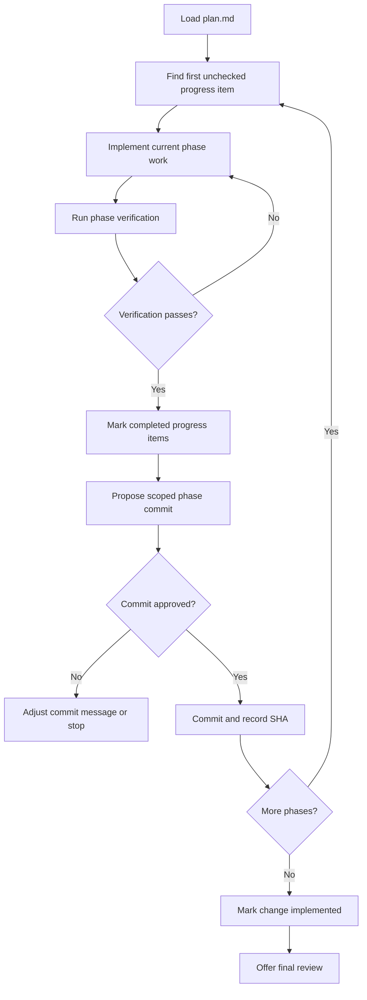
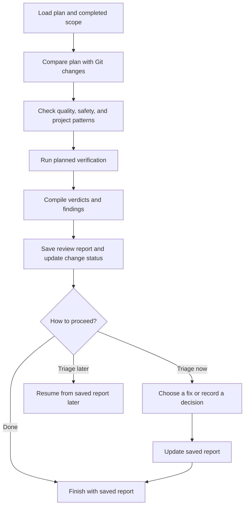

# Oracle Skills

This repository contains a small, file-based workflow for taking a GitHub issue through planning, implementation, and review. The skills live in [`.agents/skills/`](.agents/skills/) and store work for active changes in [`context/changes/`](context/changes/). Run `/oracle-init` only when the context folders have not yet been set up.

## Change Workflow



## Skills

### `/oracle-init` (optional setup)

Sets up the change-tracking folders when they do not already exist. It creates only missing items, so it is safe to run again.

```text
/oracle-init
```

It ensures these files and directories exist:

```text
context/changes/
context/changes/README.md
context/archive/
context/archive/README.md
```

If it creates files, it can optionally propose a dedicated branch and commit. Existing files and unrelated working-tree changes are left alone.



### `/oracle-new`

Starts a change from an open GitHub issue in this repository.

```text
/oracle-new https://github.com/OWNER/REPO/issues/123
```

The skill validates the URL, confirms GitHub CLI authentication, assigns the issue to you, derives a concise `gh-<issue>-<slug>` branch name, creates and pushes that branch from `origin/main`, then writes:

```text
context/changes/gh-123-example-change/change.md
```

Use the exact issue URL from this repository. It stops safely if the issue is closed, the branch or change folder already exists, GitHub authentication fails, or the remote is not a GitHub repository.



### `/oracle-plan`

Turns a change request into a detailed, reviewed implementation plan.

```text
/oracle-plan gh-123-example-change
```

You can also pass a relevant file, such as a research document or frame brief:

```text
/oracle-plan @context/changes/gh-123-example-change/research.md
```

The skill reads the supplied context, researches the codebase, clarifies unresolved decisions, and creates `plan.md` plus a concise `plan-brief.md` in the change folder. `plan.md` includes phases, success criteria, scope boundaries, and a `## Progress` section. That Progress section is the source of truth for later implementation.



### `/oracle-implement`

Executes an approved plan phase by phase.

```text
/oracle-implement gh-123-example-change
```

To resume or target one phase:

```text
/oracle-implement gh-123-example-change phase 2
```

The skill reads `plan.md`, starts at the first unchecked item in `## Progress`, implements and verifies each phase, and updates only the completed progress items. It tracks files touched per phase, proposes explicit commits for user approval, and records the resulting commit SHA beside completed progress rows. When every progress item is complete, it marks `change.md` as `implemented` and offers a final review.



### `/oracle-impl-review`

Checks completed implementation work against its plan for drift, unsafe choices, pattern inconsistencies, and unmet success criteria.

```text
/oracle-impl-review gh-123-example-change
```

For a focused review of one completed phase:

```text
/oracle-impl-review @context/changes/gh-123-example-change/plan.md phase 2
```

The review compares the plan with the Git diff, runs the plan's automated checks, and produces a persisted report in one of these locations:

```text
context/changes/<change-id>/reviews/impl-review.md
context/changes/<change-id>/reviews/impl-review-phase-<N>.md
```

Each finding has severity, impact, location, evidence, and a recommended fix. You may triage findings immediately, resume a saved report later, or leave the report for manual follow-up. The skill makes code changes only after you choose a specific fix.



## Typical session

```text
/oracle-new https://github.com/OWNER/REPO/issues/123
/oracle-plan gh-123-example-change
/oracle-implement gh-123-example-change
/oracle-impl-review gh-123-example-change
```

If this is a new repository and `context/changes/` does not exist, run `/oracle-init` once before starting the session.

## Change records

Each active change has its own directory under `context/changes/<change-id>/`. Common artifacts are:

| File or directory | Purpose |
| --- | --- |
| `change.md` | Change identity, linked issue, lifecycle status, and dates. |
| `research.md` / `frame.md` | Optional research and problem-framing inputs for planning. |
| `plan.md` | The implementation plan and authoritative progress checklist. |
| `plan-brief.md` | A short, stakeholder-friendly plan summary. |
| `reviews/` | Saved implementation-review reports and triage decisions. |

`context/archive/` is reserved for completed change records and is read-only by convention. Some skill text refers to `/oracle-archive` and `/oracle-status`; those skills are not currently included in this repository, so use the five skills documented above as the available workflow.

## Conventions and safety

- Do not edit a completed plan's `## Progress` checklist casually; it drives resume behavior and completion status.
- Use an active change under `context/changes/`; implementation and review refuse to modify archived plans.
- Keep Git commits scoped to the files touched by the current phase. The implementation skill asks for approval before committing.
- Review is deliberately non-destructive: it reports findings first and applies a change only after your explicit triage decision.
